# 2025年top 20最佳作品集建站平台

想用更低门槛和更可控成本，快速上线专业的作品集与网站？这份作品集建站平台精选，覆盖摄影师网站、设计师个人站到内容+电商一体化的多种场景。
聚焦模板质量、客户相册、SEO、可用性与扩展性，帮你在稳定性、速度与运营效率之间找到最佳平衡。
你将获得可执行的选型建议：从零上手、作品呈现、在线销售到后期维护，少走弯路。

## [Pixpa](https://pixpa.com)
为创作者打造作品集与商店一体

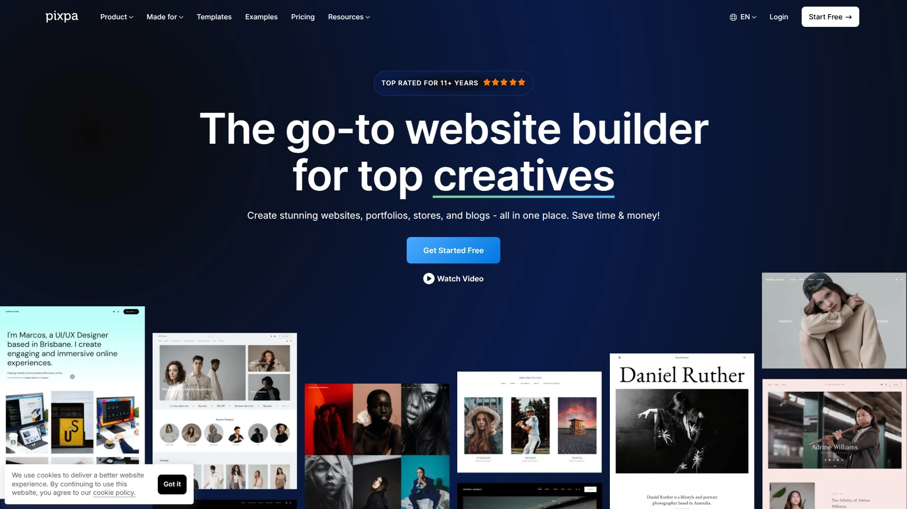

- 一体化：作品集、客户相册、博客与商店打通，流程更顺滑。
- 上手快：拖拽编辑+专业模板，几小时即可发布首版。
- 面向摄影师：客户相册（选片、下载、隐私权限）与销售闭环更完善。
- 运营所需：内置基本 SEO、表单、公告栏与营销组件，覆盖常用场景。
- 适合人群：摄影师、设计师、插画师、自由职业者的作品展示与变现。

## [Squarespace](https://www.squarespace.com)
美学领先的全能型网站与电商平台

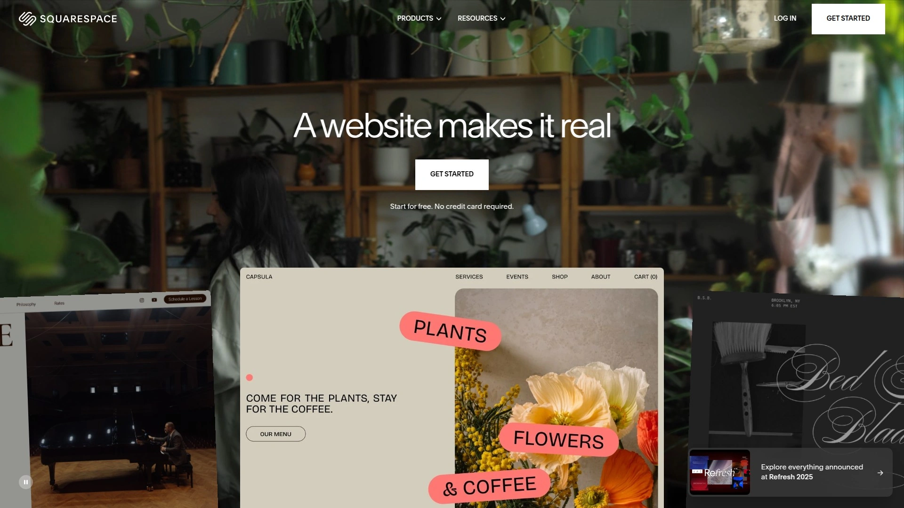

- 模板审美统一，适合品牌感强的作品集与工作室网站。
- 页面编辑流畅，区块丰富；内置博客、会员区、邮件营销。
- 电商能力稳定，可做内容+商品的组合运营。
- 适合追求设计一致性、少插件维护的个人与小团队。

## [Wix](https://www.wix.com)
海量模板与拖拽编辑的可视化建站

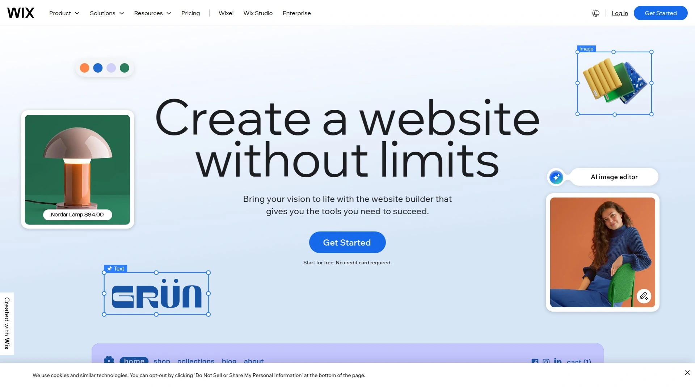

- 模板与组件数量非常丰富，覆盖作品集、活动、预订等场景。
- Wix ADI 可快速生成初版站点，适合新手试水。
- 应用市场扩展广，便于逐步升级网站能力。
- 适合需要更多小组件与自由布局的创作者。

## [Webflow](https://webflow.com)
专业级可视化与代码并行的建站

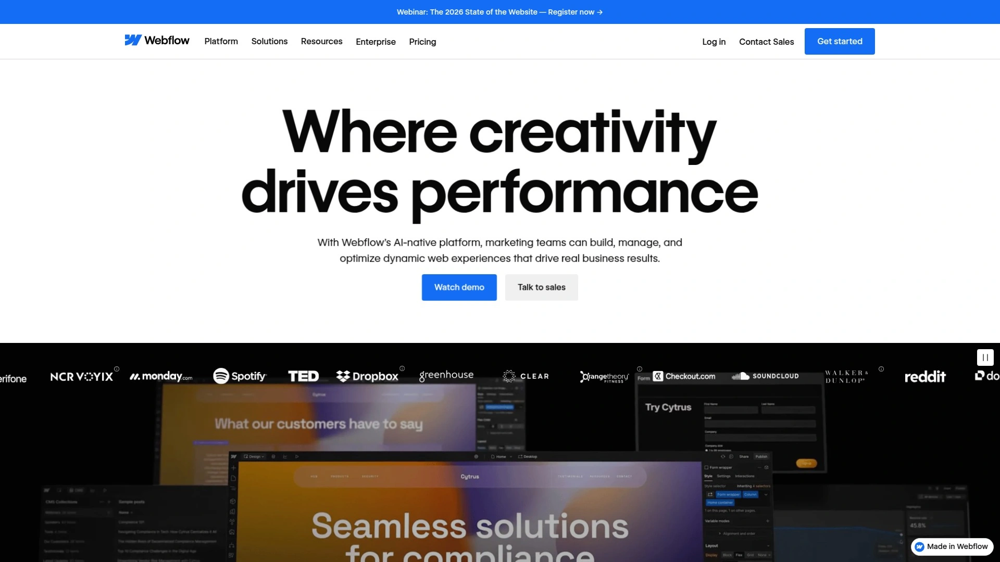

- 设计驱动的可视化开发，动画与交互表现力强。
- 原生 CMS，适合内容结构化与规模化维护。
- 更友好于懂设计/前端的团队，像素级控制与 SEO 深度优化更易实现。
- 适合品牌型作品集与长线内容运营。

## [WordPress.com](https://wordpress.com)
托管式WordPress平台，稳定易扩展

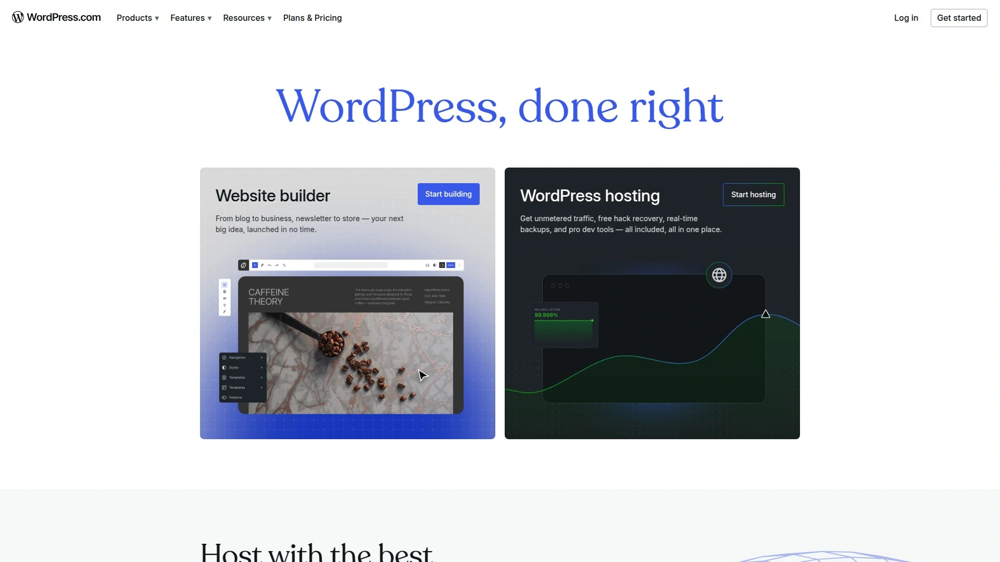

- 经典博客与作品集之选，主题与插件生态成熟。
- 托管省心，免去运维压力；可扩展电商与会员功能。
- 适合内容驱动的创作者，长期运营成本可控。

## [Shopify](https://www.shopify.com)
以销售为核心的内容加电商平台

- 强电商能力叠加主题系统，可搭建“作品集+商店”。
- 应用生态健全，适合摄影周边、定制印刷、数字下载等商品销售。
- 数据分析与订单处理顺畅，利于增长与复购。

## [Zenfolio](https://zenfolio.com)
摄影师专用的作品集与客户相册

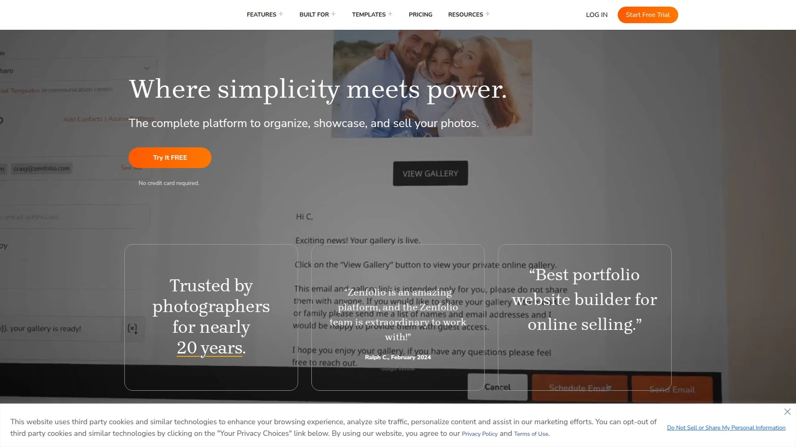

- 为摄影业务定制：客户相册、选片、下载、授权与价格管理。
- 作品站与工作流程一体，交付效率更高。
- 适合婚礼、人像、商业摄影等专业方向。

## [SmugMug](https://www.smugmug.com)
高可靠照片托管与相册销售方案

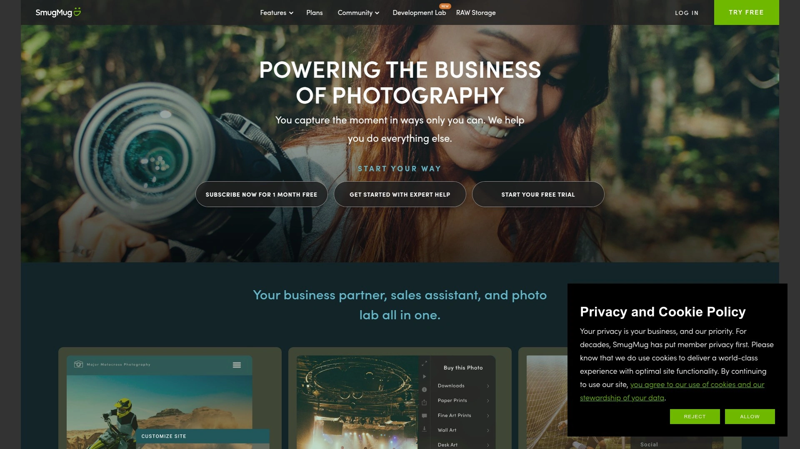

- 大图托管稳、相册权限细，画质与访问速度兼顾。
- 可配置打印/数字销售，品牌化展示灵活。
- 适合重视图像品质与相册体验的摄影师网站。

## [Format](https://format.com)
极简审美的创作者作品集平台

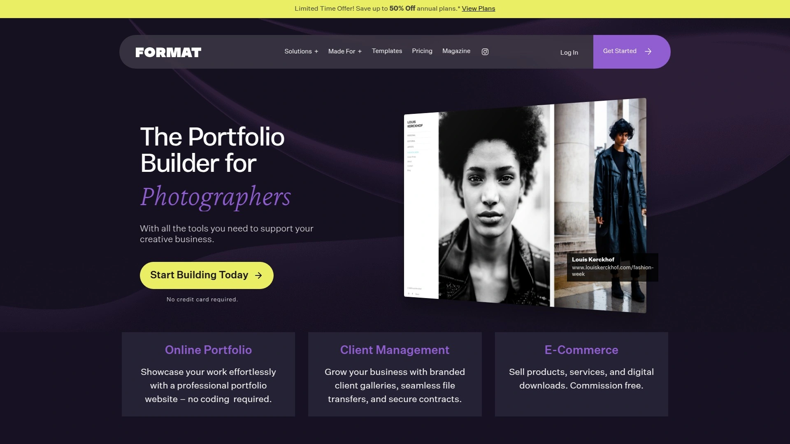

- 现代化模板，优秀的作品呈现与排版。
- 提供客户校样与在线商店，便于一站式运营。
- 适合视觉设计、插画、摄影等创意职业。

## [Pixieset](https://pixieset.com)
客户相册与工作室网站一体化

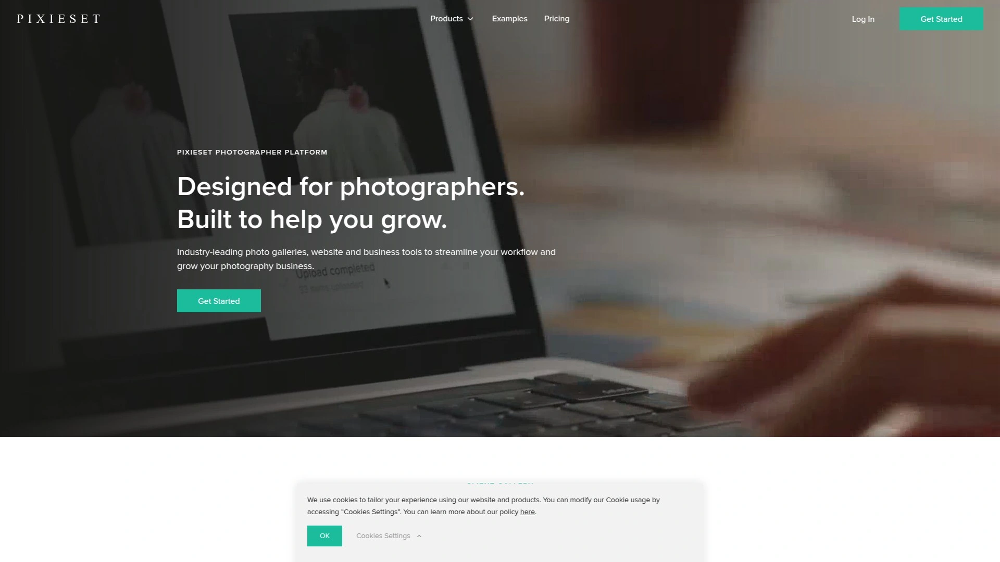

- Client Gallery、网站与 Studio Manager 打通，拍摄到交付更高效。
- 在线销售、下载与权限管理简单直观。
- 适合内容+客户服务并重的摄影业务。

## [PhotoShelter](https://www.photoshelter.com)
专业摄影作品展示与在线分发

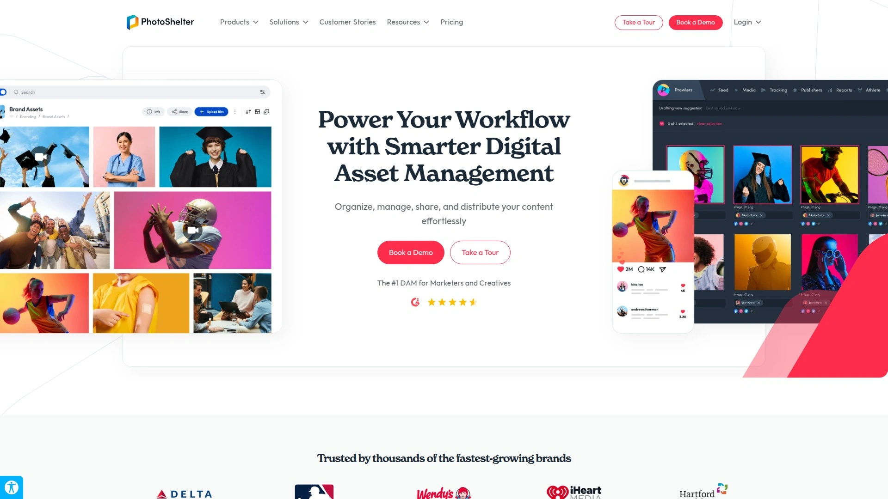

- 专注影像资产管理：作品展示、存档、授权与销售。
- 面向专业摄影师与机构的更完整工作流。
- 适合需要长期管理大量图片与版权的团队。

## [ShootProof](https://shootproof.com)
客户选片、下单与相册交付平台

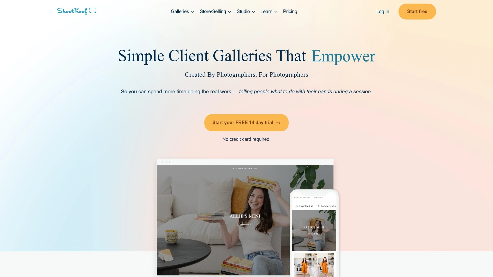

- 相册交付、合同与发票、订单流程一体化。
- 支持品牌化体验与多场景拍摄业务。
- 适合需要规范化业务流程的摄影工作室。

## [Duda](https://www.duda.co)
适合机构的多站点白标建站平台

- 可管理多客户与多站点，权限与协作完善。
- 模板系统成熟，页面性能优化到位。
- 也适合对外接单的自由职业者/小型代理商。

## [Hostinger Website Builder](https://www.hostinger.com/website-builder)
AI驱动的一体化建站与托管

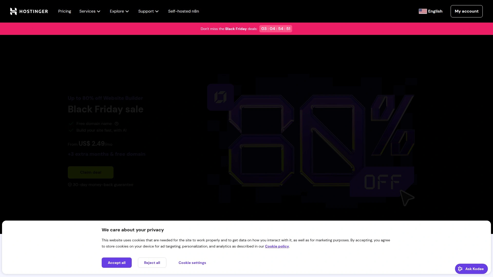

- 建站+主机+域名整合，预算友好。
- AI 生成初版布局与文案，适合新手快速上线。
- 性能与基础 SEO 工具到位，易于维护。

## [Strikingly](https://www.strikingly.com)
一页式快速上线的个人作品集

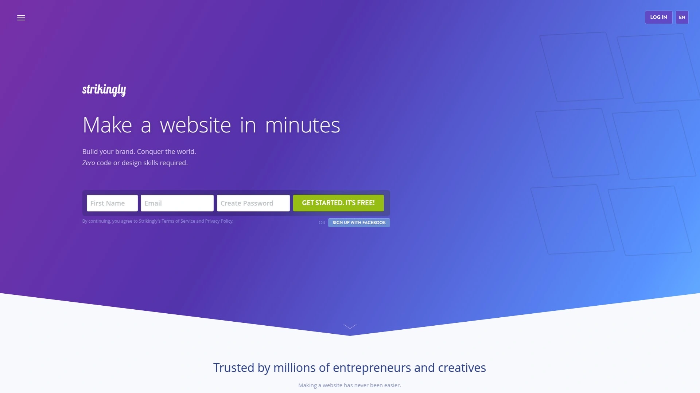

- 一页式体验，信息聚焦；上线速度快。
- 支持基础博客/表单/简单商店。
- 适合个人简历、单一作品集或活动页。

## [BigCommerce](https://www.bigcommerce.com)
可扩展的电商驱动网站方案

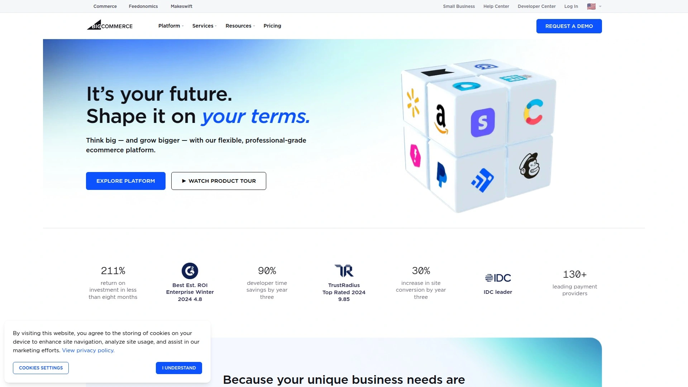

- 面向成长型店铺的电商内核，适合作品集+商品矩阵。
- 与内容系统配合良好，支持更复杂目录与价格策略。
- 适合以销售为主的创作者品牌。

## [Webnode](https://www.webnode.com)
多语言与轻量建站的便捷选择

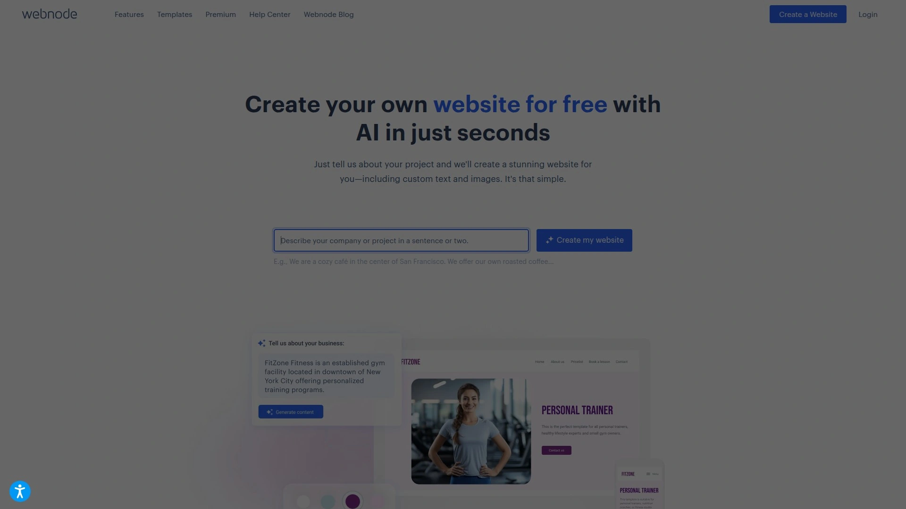

- 多语言站点搭建简单，适合面向海外的作品集。
- 模板轻量，上手成本低。
- 适合想快速发布多语网站的个人用户。

## [SITE123](https://www.site123.com)
新手向导化的极速建站工具

- 向导式流程，几步完成核心页面。
- 预设模块覆盖作品展示、联系我们、基础 SEO。
- 适合零经验用户的入门作品集网站。

## [Jimdo](https://www.jimdo.com)
AI辅助的中小团队网站搭建

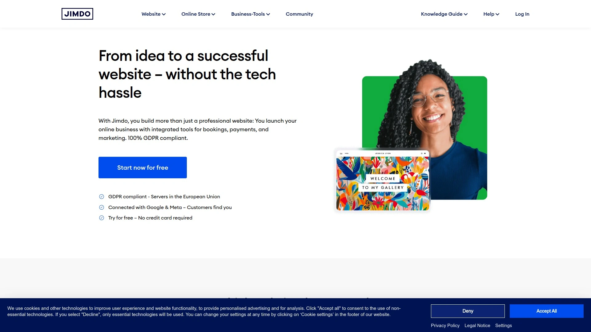

- AI 编辑器生成结构与文案，省去大量重复劳动。
- 支持基础商店与联系表单。
- 适合初创团队与自由职业者的低维护站点。

## [Framer](https://www.framer.com)
设计驱动的高互动可视化建站

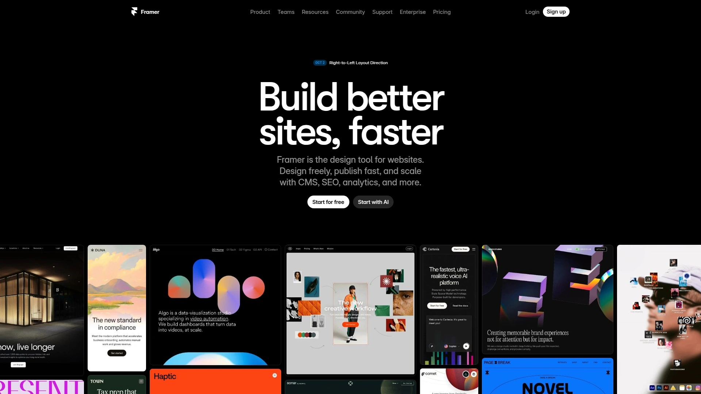

- 动效与交互表现力强，适合创意型作品集。
- 可与 Figma 衔接，设计到上线更顺滑。
- 内置 SEO 工具与快速托管，发布更高效。

---

### 常见问题 FAQ

- 新手如何快速搭建一个作品集建站平台上的网站？
  选定模板→导入代表性作品→配置导航与联系表单→填写标题/描述/OG 信息→绑定域名→用 PageSpeed/移动端预览校验后发布。

- 摄影师网站如何设置客户相册与销售流程更顺滑？
  按拍摄项目创建相册→设定可见性与下载权限→配置价目/支付方式→启用水印与到期时间→用一个测试订单跑通全链路。

- 评估平台效果看哪些关键指标？
  看加载速度（LCP/CLS/TBT）、模板是否支持结构化数据、基础 SEO 配置是否完善、运营成本（套餐、域名、存储、支付手续费）是否可控。

---

### 总结
以上 20 个平台覆盖从“纯作品展示”到“客户相册+在线销售”的完整链路。若你希望用更低学习成本，一站式搞定作品集与交付，[Pixpa](https://pixpa.com)在模板、客户相册与商店的一体化上更省心。
尽快做一个最小可用版本上线，后续再根据业务成长，逐步扩展到电商、博客与自动化运营。
